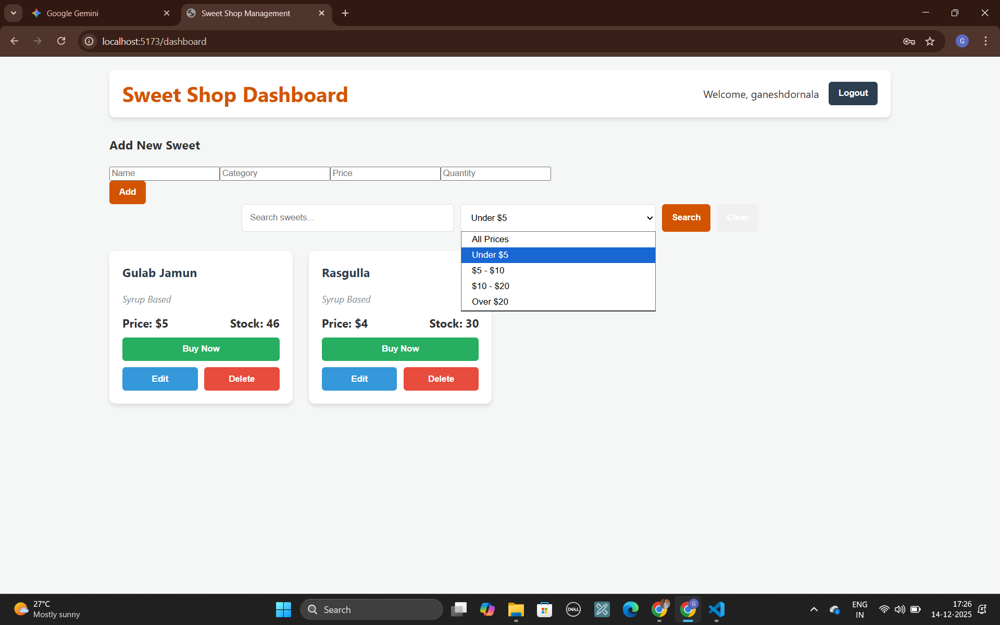
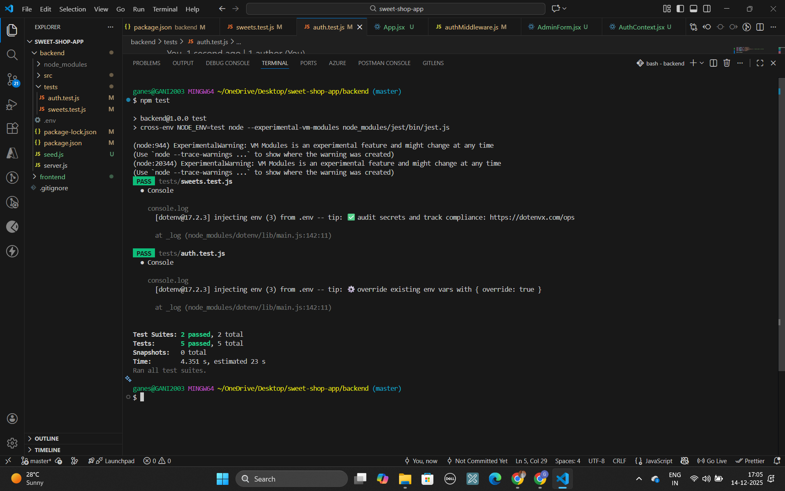

# Sweet Shop Management App 🍬

A robust full-stack application for managing a sweet shop's inventory and sales. This Single Page Application (SPA) allows users to browse sweets, filter by price, and make purchases, while providing administrators with tools to manage stock, update products, and oversee inventory.

## 🚀 Features

### User Features

- **Browse & Search:** View all available sweets in a responsive grid layout. Search by name, category, or filter by specific price ranges.
- **Purchase System:** Real-time stock validation prevents purchasing out-of-stock items.
- **Authentication:** Secure User Registration and Login using JWT (JSON Web Tokens).

### Admin Features

- **Inventory Management:** Add new sweets, update existing details, and delete items.
- **Restock:** specialized controls to increase stock quantity.
- **Protected Routes:** Admin-only actions are secured via middleware verification.

## 🛠️ Tech Stack

- **Frontend:** React (Vite), CSS3 (Custom Grid Layout), Axios, React Router v6.
- **Backend:** Node.js, Express.js.
- **Database:** MongoDB (Mongoose ODM).
- **Testing:** Jest, Supertest (Integration Testing).
- **Authentication:** JWT, Bcryptjs.

## ⚙️ Setup & Installation Instructions

Follow these steps to get the project running locally.

### Prerequisites

- Node.js (v14 or higher)
- MongoDB (Atlas connection string or local instance)

### 1. Backend Setup

Navigate to the backend folder and install dependencies:

```bash
cd backend
npm install


Create a .env file in the backend folder with the following variables:

Code snippet

PORT=5000
MONGO_URI=your_mongodb_connection_string
JWT_SECRET=your_secret_key_here
Start the server:

Bash

npm start
# OR for development mode with nodemon
npm run dev
2. Frontend Setup
Open a new terminal, navigate to the frontend folder, and install dependencies:

Bash

cd frontend
npm install
Start the React development server:

Bash

npm run dev
Access the application at http://localhost:5173.

🧪 Running Tests
This project follows Test-Driven principles. The backend includes a suite of integration tests using Jest and Supertest to verify API endpoints and Database interactions.

To run the tests:

Bash

cd backend
npm test
Test Coverage:

Auth: Verifies Register, Login, Duplicate User prevention, and Token generation.

Sweets: Verifies GET /api/sweets and Price Range filtering logic.

📸 Screenshots

### 🧁 Dashboard & Price Filter


### ✅ Test Report (All Tests Passed)



🤖 My AI Usage
In compliance with the project guidelines, I utilized Google Gemini as an AI co-author to assist in the development lifecycle.

Boilerplate & Architecture: I used Gemini to generate the initial Mongoose schema models and the basic Express route structure, allowing me to focus on the business logic immediately.

Debugging & Configuration: I encountered issues with Jest configuration (ES Modules vs CommonJS). I used AI to analyze the error logs and it suggested the correct cross-env and experimental-vm-modules flags for package.json.

Refactoring: I leveraged AI to help refactor the search controller. Initially, I only had text search; the AI helped me integrate the MongoDB $gte and $lte operators to support the "Price Range" dropdown feature seamlessly.

Testing: I used AI to generate the supertest boilerplate for the authentication tests, specifically asking it to handle the database connection teardown (beforeAll/afterAll) to prevent test timeouts.

Reflection: Using AI tools significantly reduced the time spent on configuration "hell" (especially with testing tools) and allowed me to implement more robust features like the Price Filter and complex Admin logic within the timeframe.

📄 License
This project is for assessment purposes.
```
